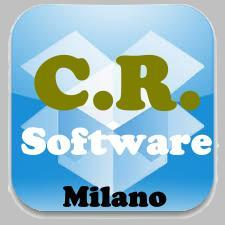
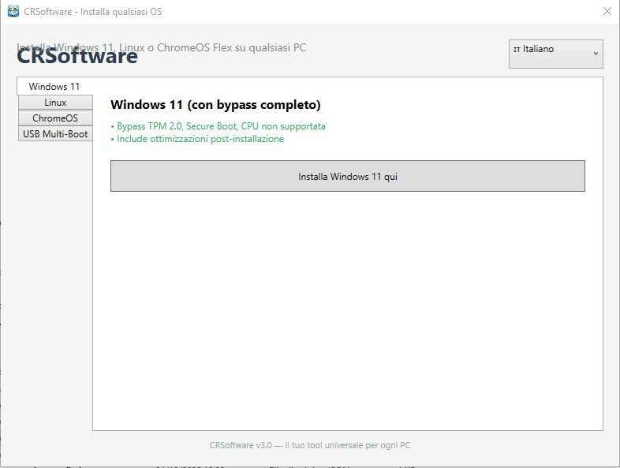

<<<<<<< HEAD
#  CRSoftware

**Il tuo tool universale per installare Windows 11, Linux e ChromeOS Flex su qualsiasi PC — anche senza requisiti!**

## ✨ Funzionalità
- ✅ **Windows 11 in italiano** (con bypass TPM 2.0, Secure Boot, CPU non supportata)
- 🐧 **Distro Linux**: Ubuntu, Kubuntu, Xubuntu, Linux Mint, Fedora, Debian
- 🖥️ **ChromeOS Flex** (Google) per vecchi PC
- 🔧 **Ottimizzazione post-installazione**:
  - Installa solo i browser che ti servono (Chrome, Firefox, Brave, Opera)
  - Rimuovi bloatware Microsoft
  - Abilita Avvio Veloce
  - Disattiva telemetria e servizi inutili

## ▶️ Come usare
1. Scarica `CRSoftware.exe` dalla sezione [Releases](https://github.com/LelloDeeJay/CRSoftware/releases)
2. Esegui su qualsiasi PC (non richiede .NET installato)
3. Scegli il sistema da installare

## 📄 Licenza
Distribuito con licenza **Apache 2.0** — libero per uso personale e commerciale.e=true
=======
# CRSoftware
Realizzazione di software personalizzato
>>>>>>> 24b25e4852c07a6abf4782aa2542e066ff91ca28
